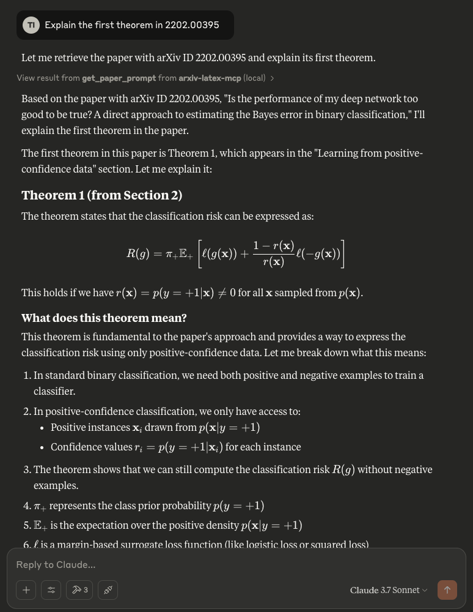

# arxiv-latex MCP Server
[](https://opensource.org/licenses/MIT)

An MCP server that enables [Claude Desktop](https://claude.ai/download), [Cursor](https://www.cursor.com/), or other MCP clients to directly access and process arXiv papers by fetching the LaTeX source. It uses [arxiv-to-prompt](https://github.com/takashiishida/arxiv-to-prompt) under the hood to handle downloading and processing the LaTeX.

Why use the LaTeX source instead of uploading PDFs? Many PDF chat applications often struggle with mathematical content and equation-heavy papers. By utilizing the original LaTeX source code from arXiv papers, the LLM can accurately understand and handle equations and notations. This approach is particularly valuable for fields like computer science, mathematics, and engineering where precise interpretation of mathematical expressions is crucial.

## Installation
Add the following configuration to your config file:
```json
{
  "mcpServers": {
      "arxiv-latex-mcp": {
          "command": "uv",
          "args": [
              "--directory",
              "/ABSOLUTE/PATH/TO/arxiv-latex-mcp",
              "run",
              "arxiv-latex-mcp.py"
          ]
      }
  }
}
```

You may need to replace the `command` field with the full path of `uv`: check this by running `which uv` (MacOS/Linux) or `where uv` (Windows).

Restart the application after saving the above.

For Claude Desktop, click on the hammer icon, and you should see `get_paper_prompt` in the list of "Available MCP tools".

## Example
Try asking questions about a paper from arXiv, e.g., "Explain the first theorem in 2202.00395"

<div align="center">
  
</div>